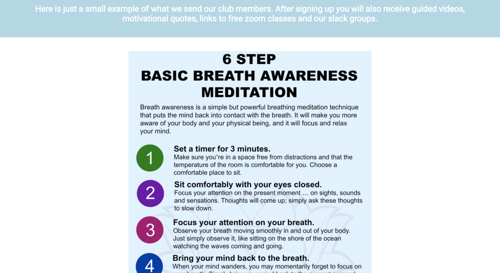

# The Meditation Club 
The Meditation Club is a website that hopes to share Meditation Techniques via email on the Daily. We send out zoom links for free classes, share guided youtube videos and even have a slack server for our welcoming group to socialise. Our goal is to grow tgether as one big online Yoga Community!

## Features 
- I set up a full responsive navigation section at the top right of my website that will bring you directly to the sections the user is looking for.This section will allow the user to easily navigate from page to page across all devices.

- I included an "About Us" section that explains The Meditation Club's goal.

- Underneath the "About Us" section I included a section called "Meditation Techniques". In this section I describe how there are many different ways of meditating and I listed off some of the many different ways of practicing it. 

- An Example of what The Meditation club members would receive is then shown below the Meditation techniques. The image describes a 6 breath awareness meditation which is a simple but powerful breathing technique that will help the user to focus and relax their mind. Club members would receive emails with Techniques like this one Daily.

 
- Sign up! Towards the bottom of The Meditaion Club website are some sign up fields where the user can enter their Name and Email to "Join Our Club"! After the user enters these details they will become a Meditation club member.

- The Footer includes links to socials Facebook, Instagram and Twitter right under the "Sign Up" field.

## Testing
I used google Chrome "inspect" tool to test out the responsiveness of my website to different screen sizes. At first It was not working so well on mobile devices and the image used would disrupt the flow of the website, until I went online to W3schools and found out how to add responsiveness to my website and the images on it. I also asked my housemates opinions of the layout and colour scheme. Although some of the colours were calming, some were out of place. I found better colours and replaced the old ones. An interesting bug I found was the padding of my bulletpoint list was messing with the responsiveness over other devices. I fixed that by using a media query and changing padding from px to percentage.
I tried to make the nav bar smoothly scroll on the webpage but it was blocked by the Hero image and would only show up once I scrolled down.

-Bugs:

-Validator testing:

## Credits:
I got my meditation techniques off of indieseducation.com.
I got my media queries from Web.dev/responsive-web-design-basics/
I retreived information of Meditation techniques from headspace.com.
I retreived my 6-Step guided meditation example from Pinterest.com.

-Media:
